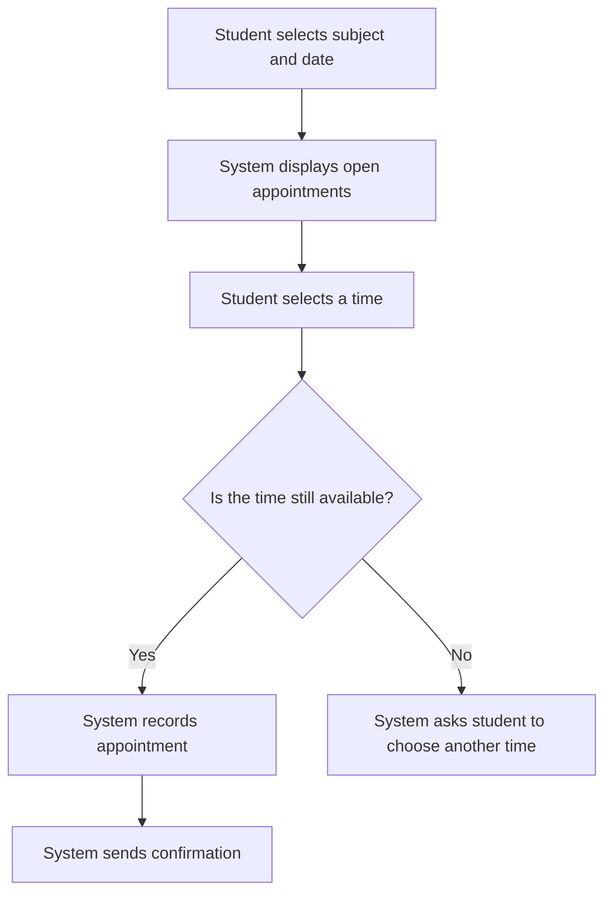

# Appointment Booking Process

This flow shows how the system handles a student booking request.

```mermaid
flowchart TD
    A[Student selects subject and date] --> B[System displays open appointments]
    B --> C[Student selects a time]
    C --> D{Is the time still available?}
    D -->|Yes| E[System records appointment]
    E --> F[System sends confirmation]
    D -->|No| G[System asks student to choose another time]
```